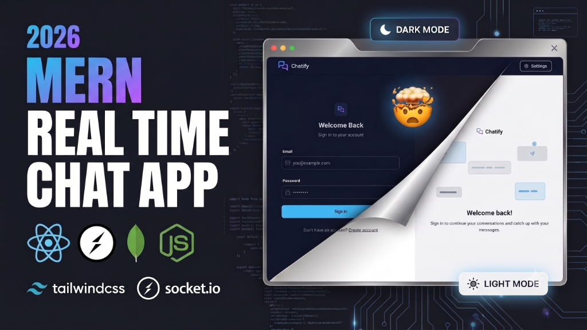

# 💬 Chatify

<div align="center">
  
</div>

A modern real-time chat application built with the MERN stack and Socket.io. Features a custom amber & slate dark theme, real-time messaging, online presence indicators, and image sharing via Cloudinary.

## ✨ Features

- **Real-time messaging** — Instant message delivery powered by Socket.io
- **Infinite Scrolling & Pagination** — Cursor-based pagination for seamless message loading at scale
- **Read Receipts & Typing Indicators** — Real-time WhatsApp-style blue ticks and typing status
- **Message Management** — Edit, delete, and manage your sent messages
- **User authentication** — Secure signup, login, and logout with JWT & HTTP-only cookies
- **Online presence** — See who's currently active in real-time
- **Image sharing** — Send and receive images in chat, powered by Cloudinary
- **Profile management** — Update your display picture anytime
- **Theme switcher** — Choose from 30+ themes including the custom Chatify dark theme
- **Responsive design** — Works seamlessly on desktop and mobile

## 🛠️ Tech Stack

| Layer             | Technology                                    |
| ----------------- | --------------------------------------------- |
| **Frontend**      | React 18, Vite, TailwindCSS, DaisyUI, Zustand |
| **Backend**       | Node.js, Express.js                           |
| **Database**      | MongoDB (Mongoose)                            |
| **Real-time**     | Socket.io                                     |
| **Auth**          | JSON Web Tokens (JWT)                         |
| **Media Storage** | Cloudinary                                    |

## 📋 Prerequisites

Make sure you have the following installed:

- [Node.js](https://nodejs.org/) (v18 or higher)
- [MongoDB](https://www.mongodb.com/) (local instance or [MongoDB Atlas](https://www.mongodb.com/atlas) cloud)
- A [Cloudinary](https://cloudinary.com/) account (free tier works)

## 🚀 Getting Started

### 1. Clone the repository

```bash
git clone https://github.com/your-username/chatify.git
cd chatify
```

### 2. Set up environment variables

Create a `.env` file inside the `backend/` directory:

```bash
touch backend/.env
```

Add the following variables:

```env
MONGODB_URI=your_mongodb_connection_string
PORT=5001
JWT_SECRET=your_jwt_secret_key

CLOUDINARY_CLOUD_NAME=your_cloud_name
CLOUDINARY_API_KEY=your_api_key
CLOUDINARY_API_SECRET=your_api_secret

NODE_ENV=development
```

### 3. Install dependencies

```bash
# Install backend dependencies
cd backend
npm install

# Install frontend dependencies
cd ../frontend
npm install
```

### 4. Run in development mode

Open **two terminals**:

```bash
# Terminal 1 — Start the backend
cd backend
npm run dev
```

```bash
# Terminal 2 — Start the frontend
cd frontend
npm run dev
```

The app will be available at `http://localhost:5173`

### 5. Build for production

From the project root:

```bash
npm run build
npm start
```

This installs all dependencies, builds the frontend, and serves everything from the Express backend on port `5001`.

## 📁 Project Structure

```
chatify/
├── backend/
│   └── src/
│       ├── controllers/     # Route handlers (auth, messages)
│       ├── lib/             # DB connection, Cloudinary, Socket.io, utilities
│       ├── middleware/       # JWT authentication middleware
│       ├── models/           # Mongoose schemas (User, Message)
│       ├── routes/           # Express route definitions
│       ├── seeds/            # Database seed data
│       └── index.js          # Server entry point
├── frontend/
│   └── src/
│       ├── components/       # Reusable UI components
│       ├── constants/        # Theme definitions
│       ├── lib/              # Axios instance, helper utilities
│       ├── pages/            # Route-level page components
│       ├── store/            # Zustand state management
│       ├── App.jsx           # Root component with routing
│       └── main.jsx          # Application entry point
└── package.json              # Root scripts (build & start)
```

## 📄 License

This project is licensed under the ISC License. See the [LICENSE](LICENSE) file for details.
